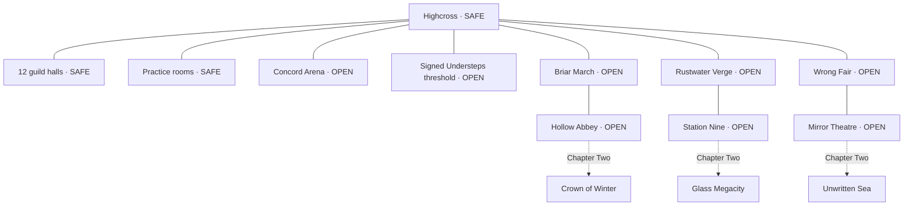

# World, encounters and narrative specification

The exact inventory of maps, NPCs, enemies, bosses and quests is in [content-catalogue.json](../design/content-catalogue.json). All names and descriptions are original THREEFOLD content. This plan preserves 3 Kingdoms' contrasting realms, shared home, guild identity and puzzle-led exploration; it does not copy its text, maps or artwork.

## Traversal map and delivery boundary

Chapter One includes 22 scene definitions: Highcross, Understeps, practice, arena, twelve halls and six realm areas. Chapter Two adds three. A scene is a authored traversal unit, not an endless terrain promise. Listed sizes are bounding footprints, not a guarantee that every square metre is navigable. Interiors reuse structural kits but have individual layout and lighting records. All three early realms unlock after the intro; deeper regions recommend levels 10–17 but do not force a linear realm order.

Map production requires a top-down route plan before a painted vista. Place entry and exit, two main routes, encounter footprints, retreat corners, vertical landmarks, clue locations, sightlines, navmesh islands and exact safety polygons. Walkable routes use 2m minimum clear width, key combat spaces 12m minimum span and visible alternative exits. Camera-facing occluders fade or cut away before hiding actors; collision never depends on decorative foliage. Limit slopes to 35°, use stairs/ramps and authored links, and ground all exits with previewable destinations.

Highcross's plaza contains the astrolabe and realm gates; inn west, Exchange east, Guild Row a horseshoe behind the plaza. Twelve hall doors are recognizable by emblem and materials, with a sign list at the row entrance. Halls connect to the single practice system through clearly labelled portals; they do not require twelve different gameplay engines. The Understeps entrance includes a visible barrier, `LEAVING SAFE TOWN` label and ground seam before the unsafe lower cistern. Town cellars above that barrier remain in Highcross's safe polygon.

Three early-region travel shrines are deliberately small safe zones, each 6m radius, marked by paired posts; they are separate from open camps. They are not in boss arenas or at quest objectives. Every region can be traversed from the preceding region without a teleport. Later Winter settlement interiors, Megacity civic hall and Sea dock sanctuary have explicit safe polygons; exterior streets remain open. Server and map share one source for these boundaries.

### Per-region composition

| Area | Encounter palette | Puzzle / route reward | Return hook |
| --- | --- | --- | --- |
| Briar March | Hounds circle; shieldbearers defend retreating archers | Standing stones, courier footprints, forest epitaph; riverbank flank | Matriarch job, foraging, Bell clue |
| Hollow Abbey | Revenants bind to visible acolytes; Warden | Drain water, reconstruct verse, reveal crypt shortcut | Relic variant, peaceful boss resolution |
| Rustwater Verge | Drones repair scrap machines; sentries cover salvage | Trace power loads and choose clinic/pump priority | Materials and a different service benefit |
| Station Nine | Warden patrols, heat constructs, Custodian | Security logs and coolant bypass | Reactor glass, prediction terminal, group boss |
| Wrong Fair | Juggler rules, ribbon lanes, breathing ticket mimic | Shadow inconsistencies and bargains with exact consequences | Costume clue, hidden performance route |
| Mirror Theatre | Replaying doubles and spotlight stagehands; Revels | Repeat gestures, redirect lights, alter final act | Stage rewards and shadow shortcut |
| Crown of Winter | Frost pilgrims and drakes; White Regent | Date tablets, thaw anchors and warm settlement | Late relic, safe refuge, oath revelation |
| Glass Megacity | Corporate pairs and memory leeches; Executor | Citizenship audit and lift rhythm | Synthetic allies, engineering recipe |
| Unwritten Sea | Ink rays and unfinished sailors; Captain | Name island anchors and read tide paths | Prestige conclusion, cosmetic sail |

Environment weather is authored and cosmetic in Chapter One: rain and puddles in Fantasy, light steam in Science, drifting paper in Chaos. Do not quietly make weather random combat modifiers. Lighting cycles may interpolate within a fixed readability range; clues and telegraphs remain legible at all phases. Later tide bridges use predictable authored timing and safe navigation endpoints, synchronized by the server.

## Character and creature cast

The catalogue defines 25 named NPCs, including every guild's mentor; five reusable civilian crowd roles and the active Concord Watch guard role supplement them. Each named NPC needs a body/variant, portrait, dialogue graph, greeting/quest-turn/farewell audio and subtitles. NPC identity must survive using a shared humanoid rig: posture, head, garment silhouette, signature prop and voice rhythm differentiate them.

Concord Watch patrols the three gates, Exchange and Guild Row. Guards attack visible red players under the [outlaw rules](pvp-and-outlaw-rules.md); service NPCs refuse commercial transactions while red. Existing realm shrines include clearly marked unpatrolled refuges and red-player respawn points, with two exits and no shops/banking. No additional region is needed. Later protected settlements reuse the guard behavior with local uniform variants.

Three example performance briefs:

- **Mara:** practical and tired, not mystical; checks her bronze fingers when the bell tolls. Greeting: “If you heard thirteen, don't tell the others yet.” Her critical verse is always available in text.
- **Patch:** clipped optimism, pack rattles after stopping, one lens moves before the body. Greeting: “Good news. Most of the water is outside the wires.” Optional comedy never delays a transaction.
- **The Velvet Usher:** measured courtesy; shadow gestures half a beat late. Greeting: “Your ticket remembers you differently.” A lie can be disproved by evidence in the same quest, not arbitrary guessing.

Merchant dialogue is short: opening, available service, unavailable condition and farewell. Guild dialogue includes identity, trial start, retry, success, join, leave and mastery branches. Quest-giver graphs include each relevant state and a repeat-summary option. No required paragraph is buried behind a one-time click. Ambient barks have a minimum 60s local repetition interval, and only one nearby NPC bark plays at a time.

The catalogue defines 23 regular/elite creature identities and six bosses. Early variants may share a skeleton and selected material family, but their tactical role must differ. A pack matriarch shares the hound rig with different scale, crest, howl and encounter logic. Mirror Double reuses player silhouettes with a distinct reflective material and a limited server-approved action vocabulary; it never executes arbitrary recorded client code. Station Nine Custodian uses a custom extension of the heavy rig for its extra legs and service arms, not a forced humanoid auto-rig.

Boss production requires front/side/back reference, gameplay silhouette, three attack poses, vulnerable state, defeat state, three dedicated mechanics, warning/impact audio and a local encounter map. The catalogue's three named mechanic entries per boss each expand into an animation, effect and sound record. Generic hit/death clips do not count as completed signature mechanics.

## Quest inventory and authoring contract

There are **44 planned quests**: three opening quests, twelve guild trials, five Chapter One story mysteries/conclusion, eighteen short jobs and six Chapter Two quests. The catalogue names every quest, giver, maps, prerequisites, ordered or parallel steps, clue, reward and recovery behavior. “Oath Without Witnesses” is the Knight trial, not a duplicate main quest.

Each quest file must implement:

1. Stable ID and version, title, giver, recommended level and prerequisites.
2. State graph: unavailable → offered → active → ready → complete, with explicit branch/checkpoint states and abandon/reacquire rules.
3. Objective predicates evaluated by the server; object IDs and interaction verbs, not prose parsing.
4. Journal entry on each observation; first-person clue text plus transcript of any audio/visual-only information.
5. Three optional hints: point to relevant clue, explain relationship, give exact next action. No timer or payment gates.
6. Personal quest flags and branch values; shared parties can observe together but each member receives durable credit.
7. Atomic reward transaction with a completion token preventing duplicates on retry, reconnect or simultaneous interaction.
8. Death, logout, abandoned escort, missing object, full bag and out-of-order discovery recovery.

All critical clues support `/look`, Examine and dialogue-topic equivalents. Specialist guild utilities reveal a faster route or extra interpretation; no main quest requires a particular guild or another player. Environmental locks always have a universal alternative, such as finding a key, aligning an inscription or using a mechanical lever. Specialist access must not bypass competitive boundaries or world collision.

### Story spine and branching consequences

**The Thirteenth Bell:** Mara suspects a missing hour. Forest epitaph dates, thirteen marks on the abbey bell and a remembered melody identify the lost verse. Players can brute-force the Warden's normal fight or learn the verse for an alternate phase and peaceful finish. Both grant core progression; the peaceful outcome changes Mara's account and relic appearance, not permanent stat superiority.

**A Light for Rustwater:** scarce power goes first to a clinic or pumps. Clinic grants cheaper recovery supplies; pumps expose a salvage route. Either choice later permits the other service by completing a job. Shared geometry never disappears for players on the other branch: service interaction and a personal door permission carry the choice.

**The Stolen Shadow:** compare performer movements, reflected movements and independently acting shadows. Evidence identifies the thief. A wrong accusation leads to a new observation without failing the entire quest. The reward disguise changes presentation to NPCs in this story; it never removes player nameplates, guild cues, targetability or hostility.

**The Man Who Died Tomorrow:** a forest epitaph, machine prediction and stolen memory describe the same person at incompatible times. Any realm order is valid. Comparing timestamps proves that someone exported an hour from Highcross. The final encounter gives a major clue rather than forcing an unearned boss fight.

**The Missing Hour:** all four mysteries lead to the Understeps clock. The saboteur is a future echo of the Cartographer, trying to prevent an accord that erases alternate lives. Preserve or disclose the evidence changes authored conversations and the Chapter Two framing. It does not globally change every player's city or lock companions out of content.

Chapter Two follows that disagreement through an ice-bound oath, synthetic citizenship and an unfinished sea. The player concludes by reconciling or rejecting the future echo's attempt. Both endings retain access to replayable regions. Ending cinematics can be a 20–40 second in-engine sequence with subtitles and a skip control; generated video is optional promotional material, not needed to understand the story.

## Placement and content acceptance

No collection objective places an item inside a wall, under opaque water or behind an unrevealed class-exclusive link. Quest objects use a subtle inspection highlight only within 6m; distant maps mark the rumour area, not secret coordinates. A revealed secret persists in personal map data. Each short job must have one encounter or observation that differentiates it from “kill ten things.” Escort jobs use three checkpoints and can be restarted from the last checkpoint; NPCs do not sprint beyond camera range.

For every map, reviewers walk both primary routes, locate all critical clues without developer overlays, verify entrances/exits and safe lines, die at a remote point and recover, and complete the area's quest using two different guilds including a form-based one. Four players must be able to read the largest fight simultaneously. Later full release repeats those checks for the three Chapter Two scenes.
